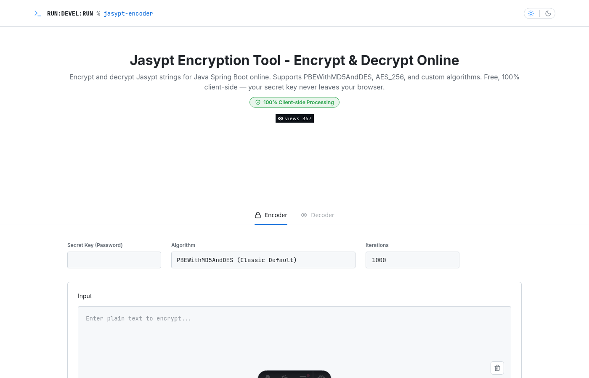
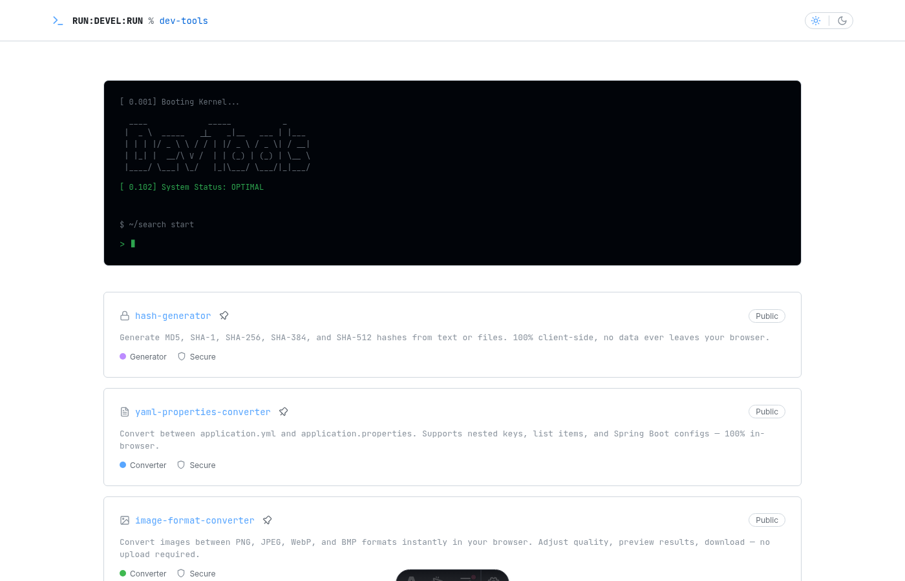

## ✋ 들어가며

"코딩을 모르면 개발을 못 한다" — 이 말이 더 이상 맞지 않는 시대가 오고 있다.

나는 최근 **바이브 코딩(Vibe Coding)**이라는 방식으로 개발자 도구 사이트 [DevTools↗](https://tools.rundevelrun.com)를 만들었다. JSON Formatter, Base64 Encoder, Hash Generator 등 12개의 도구가 올라가 있는 사이트인데, 놀라운 건 **코드를 직접 한 줄도 작성하지 않았다**는 점이다.

이 글에서는 바이브 코딩이 무엇인지, 어떤 도구를 사용했는지, 그리고 왜 비개발자도 충분히 할 수 있다고 생각하는지 이야기해보려 한다.

## 🎵 바이브 코딩이란?

바이브 코딩은 Andrej Karpathy가 2025년 2월에 소개한 개념이다. 핵심은 간단하다.

> AI에게 자연어로 "이런 거 만들어줘"라고 말하면, AI가 코드를 작성해주는 방식

기존의 개발 과정은 이랬다:
1. 요구사항 정리
2. 설계
3. 코드 작성 ← **여기서 대부분의 시간과 지식이 필요**
4. 테스트
5. 배포

바이브 코딩에서는 3번이 **"AI에게 설명하기"**로 바뀐다. 코드를 읽고 쓰는 능력보다, **내가 원하는 것을 명확하게 설명하는 능력**이 더 중요해진 것이다.

## 🛠️ 내가 사용한 도구 — Claude Code

나는 Anthropic의 **Claude Code**를 사용했다. Claude Code는 터미널에서 동작하는 AI 코딩 에이전트로, 몇 가지 특징이 있다:

- **프로젝트 컨텍스트를 이해한다** — 파일 구조, 기존 코드, 설정 파일을 스스로 읽고 파악한다
- **직접 파일을 생성하고 수정한다** — "만들어줘"라고 하면 실제로 파일을 만들어 준다
- **빌드하고 테스트한다** — 명령어를 실행해서 에러가 있으면 스스로 고친다
- **Git 커밋과 배포까지 한다** — "커밋하고 푸시해줘"라고 하면 끝이다

실제로 나는 이런 식으로 대화했다. 아래는 진짜 대화 예시들이다.

#### ***예시 1: Jasypt Encoder 도구 만들기***

```
나: "Spring Boot에서 쓰는 Jasypt 암호화 도구 만들어줘.
    PBEWithMD5AndDES 같은 알고리즘 선택할 수 있게 하고,
    Secret Key 입력하면 암/복호화 되게."

Claude: (Jasypt 암호화 페이지 생성, CryptoJS 라이브러리 설치,
        알고리즘 선택 드롭다운 구현, 인코더/디코더 탭 분리,
        SEO 설정, 빌드 테스트까지 완료)
```

그 결과물이 이거다:



한 번의 대화로 Secret Key 입력, 알고리즘 선택, Iteration 설정, 인코더/디코더 탭 전환까지 다 갖춘 페이지가 만들어졌다.

#### ***예시 2: 도구 추가는 이 정도면 끝***

```
나: "Hash Generator 도구 추가하자"

Claude: (tool 페이지 생성, 인덱스에 카드 추가, OG 이미지 설정,
        CLAUDE.md 업데이트, 빌드, 커밋, 푸시 — 전부 자동)
```

#### ***예시 3: 버그 수정도 대화로***

```
나: "탭 전환이 안 되는데?"

Claude: (코드 분석 → CSS 클래스명 충돌 발견 → 수정 → 빌드 확인)
```

내가 한 건 **무엇을 만들지 결정하고, 결과를 확인하고, 피드백을 주는 것**뿐이다.

## 🏗️ 실제로 만들어진 것들



[tools.rundevelrun.com↗](https://tools.rundevelrun.com)에는 현재 12개의 도구가 올라가 있다:

| 도구 | 설명 |
|------|------|
| JSON Formatter | JSON 정렬, 검증, 압축 |
| Base64 Encoder/Decoder | 텍스트 Base64 인코딩/디코딩 |
| Jasypt Encoder | Spring Boot 암호화 |
| Base64 Image Encoder | 이미지 ↔ Base64 변환 |
| Markdown Preview | 마크다운 실시간 미리보기 |
| PDF to HTML | PDF → HTML 변환 |
| Dummy Image Generator | 더미 이미지 생성 |
| Dummy Excel Generator | 더미 엑셀 파일 생성 |
| JWT Decoder | JWT 토큰 디코딩 |
| Image Format Converter | 이미지 포맷 변환 |
| YAML ↔ Properties | YAML/Properties 상호 변환 |
| Hash Generator | MD5, SHA-256 등 해시 생성 |

모든 도구의 공통점은 **100% 클라이언트 사이드**라는 것이다. 서버로 데이터를 전송하지 않으니 보안 걱정이 없다. 이 설계 역시 Claude Code에게 "서버 통신 절대 금지"라는 규칙 하나만 알려주면 알아서 지켜준다.

## 🤔 비개발자도 할 수 있는 이유

솔직히 말하면, 나는 개발자다. 이 프로젝트에서 개발자로서의 지식이 필요했던 순간은 딱 하나, **"어떤 도구가 필요한가"를 결정하는 것**이었다. Jasypt Encoder가 뭔지, JWT 디코더가 왜 필요한지 — 이건 개발자가 아니면 떠올리기 어려운 아이디어다.

하지만 그 외에 내가 한 일은:
- "이런 식으로 동작했으면 좋겠다" 설명하기
- 결과물 확인하고 "여기 좀 고쳐줘" 피드백 주기

이건 개발 지식이 아니라 **기획 능력**이다.

#### ***그럼 비개발자는 뭘 만들 수 있나?***

도메인 지식만 있으면 된다. 예를 들어:
- **디자이너**가 "색상 대비율 체크 도구"를 만들거나
- **마케터**가 "UTM 파라미터 빌더"를 만들거나
- **학생**이 "단위 변환 계산기"를 만들거나

**"내 분야에서 이런 도구가 있으면 좋겠는데"** 라는 생각이 들면, 그게 바로 출발점이다. 구현은 AI가 해준다.

## ⚡ 바이브 코딩의 장점과 한계

#### ***장점***

- **속도가 압도적이다** — 하나의 도구를 추가하는 데 몇 분이면 된다
- **일관성이 높다** — AI가 기존 코드 패턴을 따라 하기 때문에 스타일이 통일된다
- **반복 작업이 사라진다** — SEO 설정, OG 이미지, 광고 슬롯 같은 반복 작업을 알아서 처리한다
- **진입 장벽이 낮다** — 코딩을 몰라도 시작할 수 있다

#### ***한계***

- **복잡한 로직은 검증이 필요하다** — AI가 만든 코드가 항상 최적인 건 아니다
- **요구사항이 애매하면 결과도 애매하다** — 명확하게 설명하는 게 중요하다
- **비용이 든다** — Claude Code 같은 도구는 무료가 아니다
- **맹목적 신뢰는 위험하다** — 결과물을 반드시 확인해야 한다

## 💰 비용 이야기

이 프로젝트에 들어간 비용은 딱 두 가지다:

- **Claude Pro 구독료** — 월 $20
- **도메인 구매비** — 연 약 $10

호스팅은 **GitHub Pages**를 사용해서 완전 무료다. 서버 비용 0원. 결국 도메인과 AI 도구 비용만으로 12개의 도구가 올라간 웹 서비스를 운영하고 있는 셈이다.

## 👋

"아이디어는 있는데 구현을 못 해서" 포기했던 프로젝트가 있다면, 지금이 다시 시작할 때다.

AI가 코드를 써주는 시대. 우리에게 필요한 건 코딩 실력이 아니라 **"무엇을 만들 것인가"에 대한 명확한 비전**이다.
