## ✋ 들어가며

Android WebView 앱 테스트 자동화를 하려면 넘어야 할 게 많다.

Native context와 WebView context를 오가는 것부터, ChromeDriver 버전 매칭, Appium 서버 설정, 에뮬레이터 환경 구성까지. 시작도 하기 전에 지치는 구간이다.

그래서 AI와 함께 했다. **설계부터 CI 구성까지 전 과정을.**

## ☀️ 뭘 만들었나

테스트 자동화 프로젝트인데, 테스트할 앱이 없으면 의미가 없다. 그래서 앱도 직접 만들었다.

실제 서비스처럼 동작하는 **쇼핑몰 앱**이다. Kotlin + Android WebView 기반으로, 외부 서버 없이 로컬 HTML assets만으로 돌아간다.

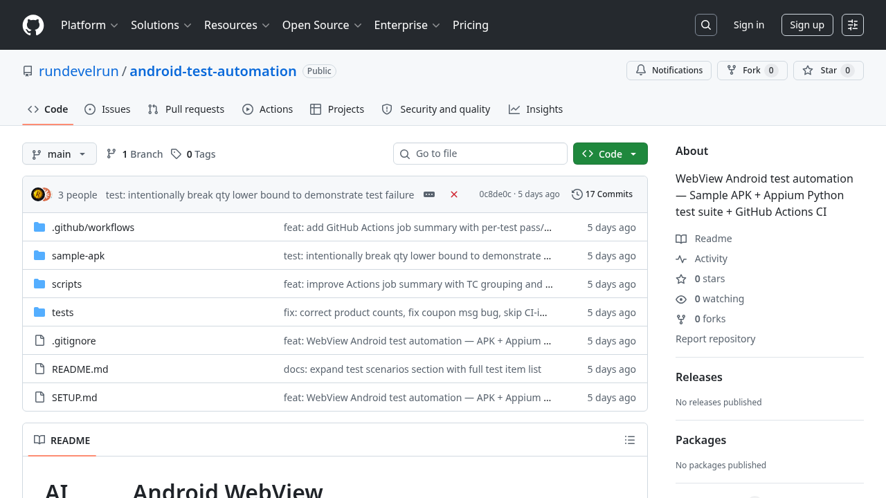

테스트하기 좋은 기능들을 의도적으로 심었다.

- **로그인** — 5회 실패 시 30초 계정 잠금
- **상품 목록** — 품절/재고 부족 배지, 세션 만료 배너
- **상품 상세** — 수량 제한(최대 10개), 품절 오버레이, 재입고 알림
- **장바구니** — 쿠폰 적용(`SAVE10`, `WELCOME`, `FAIL_TEST`), 결제 오류 처리
- **JS↔Native 브릿지** — `AndroidBridge`로 네이티브 다이얼로그 호출, 카트 배지 업데이트

## 📱 앱 화면

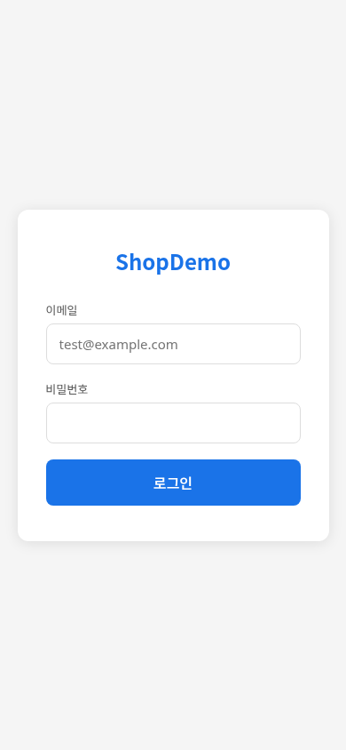

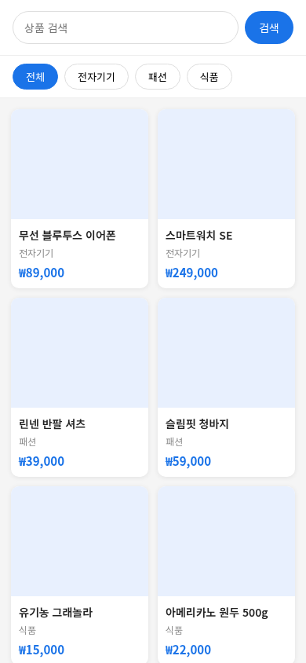

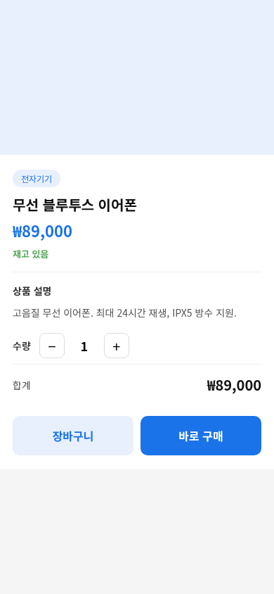

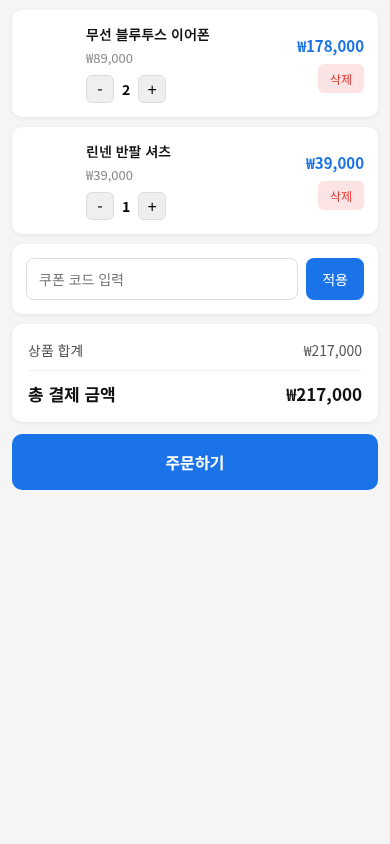

## 🧪 테스트 시나리오 — 59개

TC-01부터 TC-07까지, 총 **59개 케이스**를 자동화했다.

| TC | 영역 | 개수 |
|----|------|------|
| TC-01 | 로그인 플로우 | 7 |
| TC-02 | 상품 검색/필터 | 8 |
| TC-03 | 상품 상세 & 장바구니 | 7 |
| TC-04 | E2E 주문 완료 | 4 |
| TC-05 | Native↔WebView 컨텍스트 전환 | 7 |
| TC-06 | 네트워크 예외 처리 | 5 |
| TC-07 | 에러 케이스 | 21 |

TC-07에 21개가 몰린 이유가 있다. 계정 잠금, 품절 상품, 수량 한도, 결제 실패, 세션 만료 — 실제 서비스에서 자주 터지는 엣지 케이스들을 전부 때려넣었다.

## 🔧 핵심 구현

### WebView Context 전환

Appium에서 WebView를 테스트하려면 context 전환이 필수다. Native로 시작해서 WebView로 넘어가고, 다시 Native로 돌아오는 과정이 반복된다.

```python
def switch_to_webview(driver, timeout=15):
    end = time.time() + timeout
    while time.time() < end:
        contexts = driver.contexts
        for ctx in contexts:
            if ctx.startswith("WEBVIEW_com.example.webviewsample"):
                driver.switch_to.context(ctx)
                return
        time.sleep(1)
    raise TimeoutError("WebView context not found")
```

### 실패 시 스크린샷 자동 캡처

테스트가 실패하면 그 순간의 화면을 자동으로 찍어서 HTML 리포트에 박아둔다. CI에서 터졌을 때 뭔 일이 있었는지 바로 알 수 있다.

```python
@pytest.hookimpl(hookwrapper=True)
def pytest_runtest_makereport(item, call):
    outcome = yield
    report = outcome.get_result()
    if report.when == "call" and report.failed:
        driver = _driver_store.get(item.nodeid)
        driver.switch_to.context(NATIVE_CONTEXT)
        driver.save_screenshot(filename)
```

### ChromeDriver 자동 매칭

에뮬레이터마다 WebView 버전이 다르다. CI에서 매번 ChromeDriver를 수동으로 맞추면 귀찮으니까, `adb dumpsys`로 버전을 감지하고 `chromedriverAutodownload: True`로 자동 매칭한다.

```python
# scripts/ci_setup_capabilities.py
version = get_webview_version(device)
write_capabilities(device, version)
```

## ⚙️ CI/CD 파이프라인

push to main 또는 PR이 트리거다.

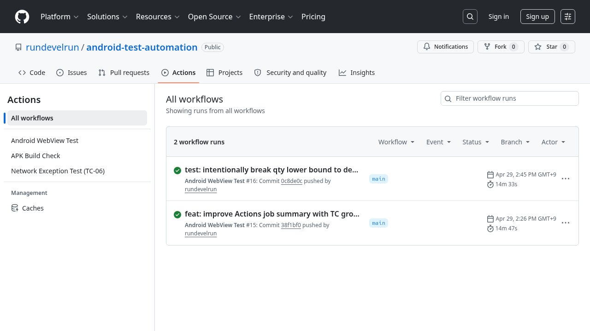

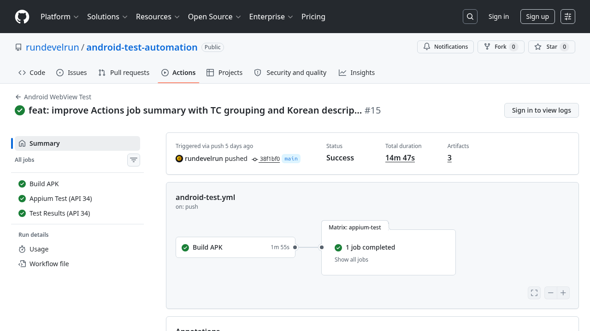

흐름은 단순하다.

1. **Job 1: APK 빌드** — JDK 17 + Gradle 8.2로 debug APK 빌드
2. **Job 2: Appium Test** — API 34 에뮬레이터(KVM 가속) 위에서 pytest 59개 실행

AVD 스냅샷을 캐시해뒀으니까 에뮬레이터 부팅 시간은 캐시 히트 시 대폭 단축된다.

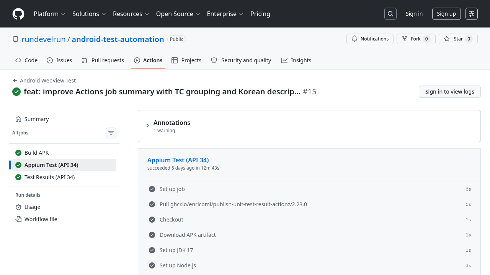

## 📊 GitHub Actions Job Summary

테스트가 끝나면 `generate_summary.py`가 `junit.xml`을 파싱해서 Job Summary에 결과를 자동으로 올린다. TC별로 묶어서 ✅/❌/⏭ 아이콘과 소요 시간을 표시한다.

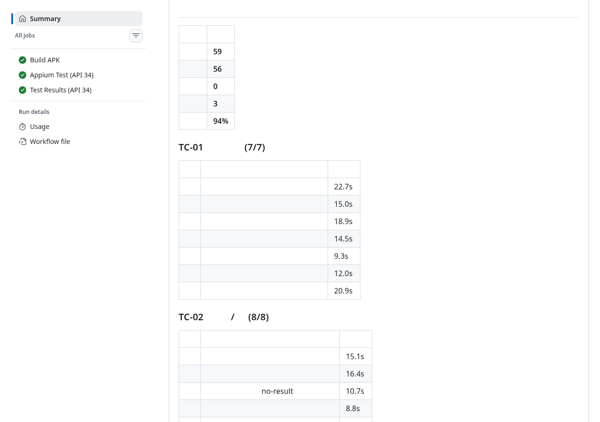

의도적으로 버그를 심어서 실패시킨 커밋도 있다. TC-03의 수량 하한 체크를 일부러 망가뜨렸다. CI가 제대로 잡아내는지 검증하려고.

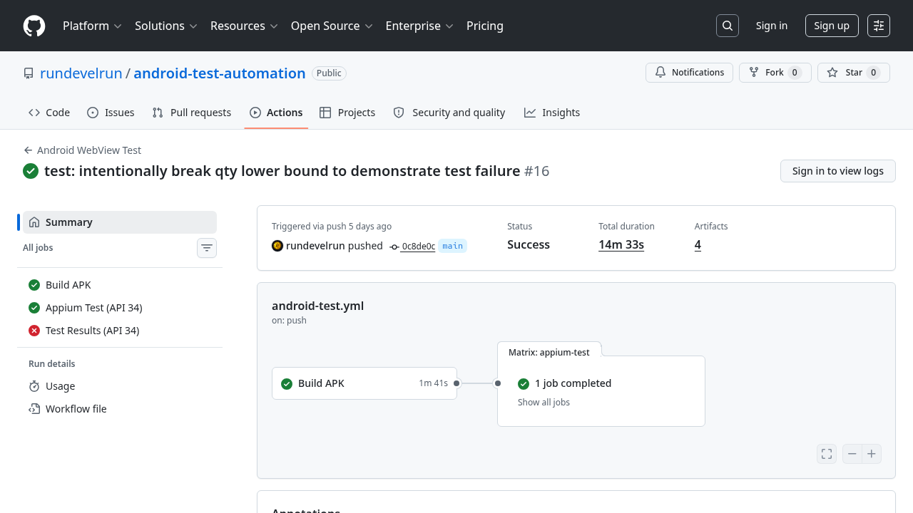

`EnricoMi/publish-unit-test-result-action`으로 PR 체크에도 결과가 붙는다.

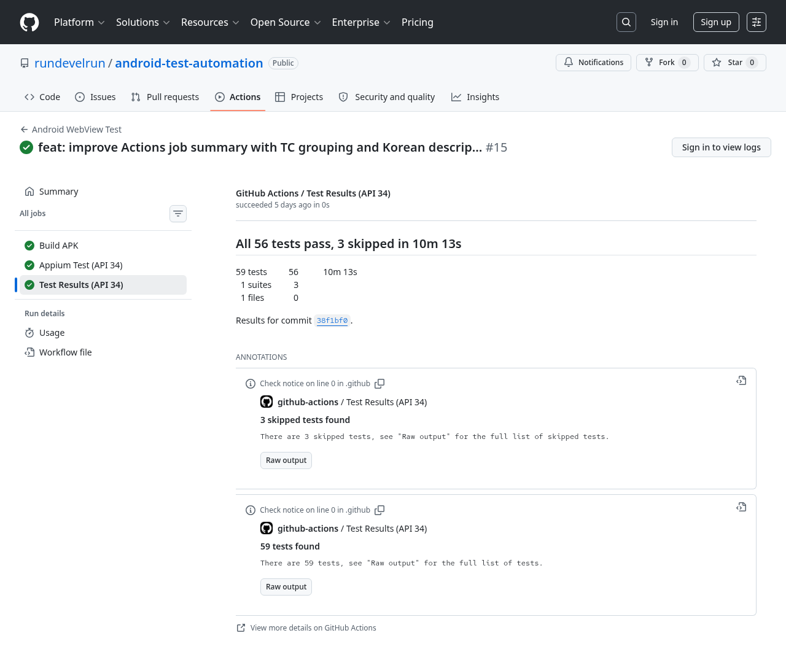

## 🤝 AI 협업 — 솔직한 회고

### 효과적이었던 구간

**시나리오 설계.** "쇼핑몰 앱에서 테스트해야 할 엣지 케이스 뽑아줘"라고 하면 AI가 체계적으로 꺼낸다. 혼자 했으면 세션 만료, FAIL_TEST 쿠폰, 품절 상품 재입고 알림 같은 케이스는 한참 뒤에야 생각났을 것 같다.

**환경 설정 디버깅.** ChromeDriver 버전 불일치, GitHub Actions의 sh 문법 오류, APK 서명 문제. 에러 로그 붙여넣으면 원인과 수정 코드가 바로 나온다. 구글링보다 빠르다.

**반복 작업.** 7개 TC × 평균 8개 케이스의 Page Object 코드를 일관된 구조로 찍어내는 건 AI가 잘한다.

### 덜 효과적이었던 구간

> 💬 *실제 에뮬레이터에서 돌려보기 전까지는 AI도 모른다.*

에뮬레이터 동작 검증은 결국 직접 해야 했다. CI 캐시 전략 튜닝도 실행 결과 데이터 없이는 AI도 추측 수준이다.

**역할 분담을 정리하면:**

- AI → 설계, 코드 생성, 디버깅 제안
- 나 → 방향 결정, 실행 검증, 최종 판단

## 👋 마치며

"테스트 자동화는 설정이 반이다"라는 말이 있다. 맞는 말이고, 그 설정 절반을 AI와 함께 하니까 속도가 달랐다.

코드를 짜는 사람이 아니라 **방향을 잡고 검증하는 사람**으로 역할이 바뀌는 느낌이었다. 테스트 자동화를 시작하고 싶은데 환경 구성에서 막혀있다면, AI랑 같이 해보는 것도 나쁘지 않다.

전체 코드는 [GitHub](https://github.com/rundevelrun/android-test-automation)에 공개되어 있다.
