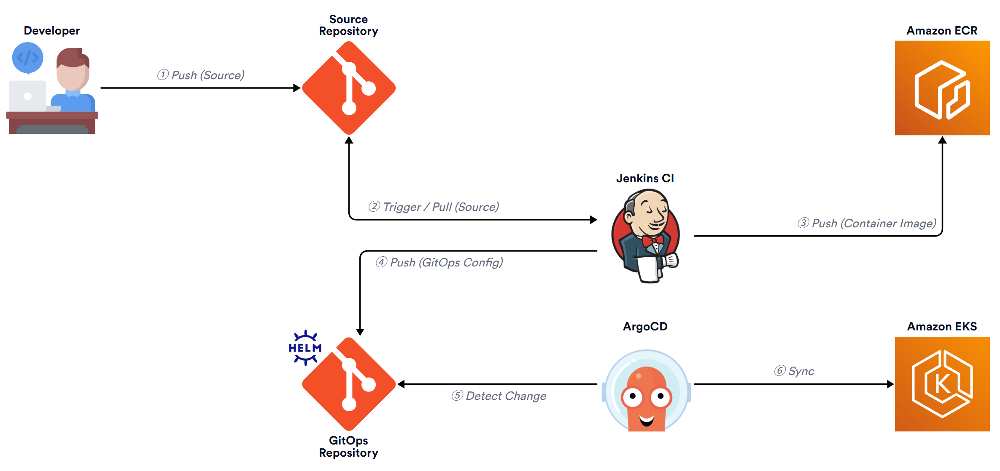

## ✋ 들어가며
프리랜서 아키텍처 혹은 개발자로 대부분의 시간을 살아오면서 GitOps에 대한 경험을 할 기회가 많지 않았는데 최근 프로젝트에서 클라우드 인프라를 관리하기 위한 워크플로우를 경험하게 되었다.

## 🔎 GitOps가 뭐야?

GitOps는 Git 리포지토리를 단일 정보 소스로 사용하여 인프라를 코드로 제공하며, 제출된 코드에서는 CI 프로세스를 확인하고,
CD 프로세스에서는 보안, 코드형 인프라(IaC) 또는 애플리케이션 프레임워크에 설정된 기타 경계와 같은 요구 사항을 확인하고 적용한다.
코드에 대한 모든 변경 사항이 추적되므로 업데이트를 손쉽게 수행할 수 있으며 롤백이 필요한 경우 버전 제어 기능도 제공된다.

## 💡 GitOps의 핵심 아이디어

- 배포에 관련된 모든 것을 선언형 기술서(Declarative Descriptions) 형태로 작성하여 Config Repository(혹은 Environment Repository)에서 관리한다. 
- Config Repository의 선언형 기술서와 운영 환경 간 상태 차이가 없도록 유지시켜주는 자동화 시스템을 구성한다.

## 🎡 내가 경험해본 GitOps Workflow

최근 프로젝트에서 경험했던 GitOps의 Workflow는 아래 작성한 이미지로 요약할 수 있다.

#### ***흐름을 살쳐보면..***

1) 애플리케이션 소스를 Source Repository에 Push한다.
2) 이전 단계에서 Webhook이 발생하거나 수동으로 처리하는 빌드 등의 Trigger가 발생하면 Jenkins에서 최신 소스를 내려받아서 이후 파이프라인에 작성된 절차가 수행된다.
3) 내려받은 최신소스의 빌드를 진행하고 생성된 Container Image를 Amazon ECR(Elastic Container Registry)에 Push한다.
4) Helm Chart를 사용해서 매니페스트 템플릿에 Container Image ID를 포함한 설정 정보를 변경하고 Config Repository에 Push한다.
     _그림에는 표현되어있지 않지만 IaC(Infrastructure as Code)를 활용해서 Amazon EKS(Elastic Kubernetes Service) 클러스터가 생성되어있는데 이때는 Terraform이 사용되었다._
5) ArgoCD에서 Config Repository에 의도된 상태와 현재 상태의 차이를 감지한다. 
6) Config Repository를 기반으로 EKS 클러스터에 동기화를 수행한다.

## 📖 참고자료

> [GitOps란: Git 기반의 지속적인 운영 및 배포 방법론 적용](https://www.redhat.com/ko/topics/devops/what-is-gitops)
>  
> [데브옵스의 확장 모델 – 깃옵스(GitOps) 이해하기 | 인사이트리포트 | 삼성SDS](https://www.samsungsds.com/kr/insights/gitops.html)

## 👋 마치며

AWS에서 이러한 환경을 경험해봤는데 더 깊이있는 이해를 위해서 다시 한번 실습해보는 시간을 가져봐야겠다.